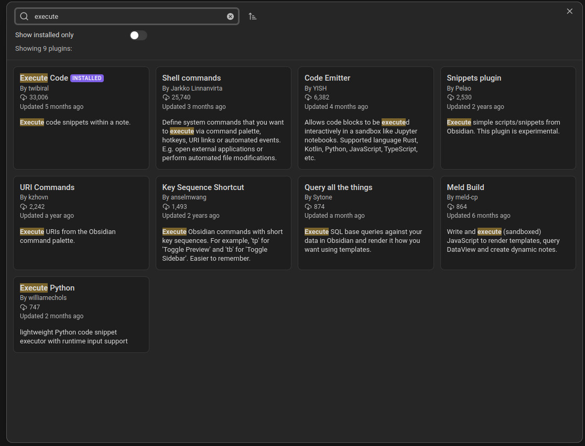
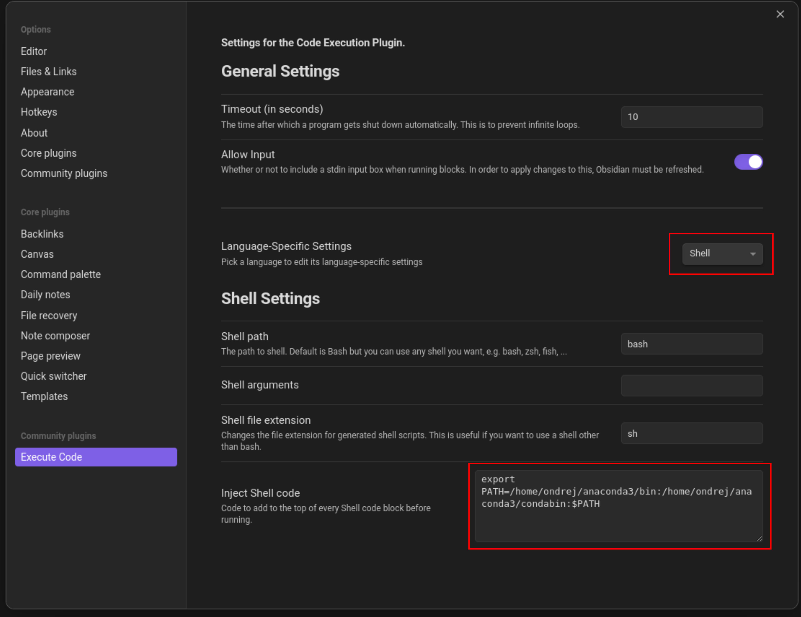
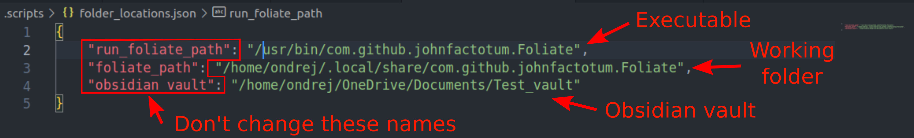
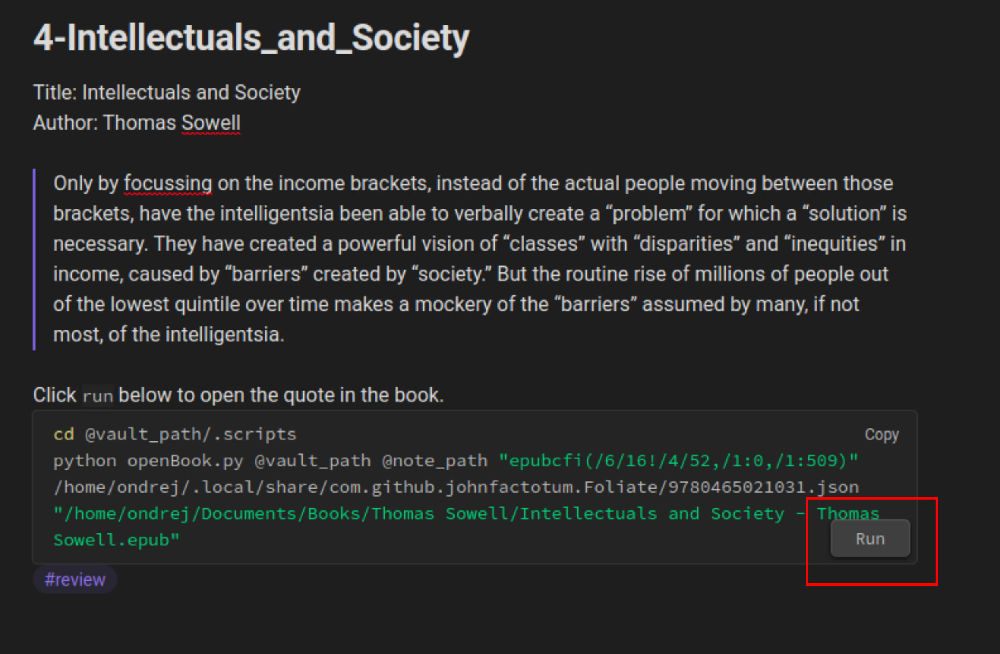

# Foliate to Obsidian Highlight Importer

## Description
This set of scripts imports highlights from all the books in your Foliate library into Obsidian. A new folder is created in your Obsidian vault called `highlights`. The highlights for each book are stored as individual markdown files in a subfolder that bears the name of the book.

This assumes you are running Linux, have python installed (with Pandas), and are not afraid to make some minor code edits. It has not been tested for any kind of compatibility. It is just a personal script that I have used a couple of times.

Use at your own risk!!!

## Setup

1. Install the "Execute Code" community plugin in Obsidian
    -Enable community plugins
    -Browse community plugins
    -Search for "Execute Code"
    -Install and activate after install
    

2. The Execute Code plugin needs to know where your python install is located
    -Click the gear icon on the Execute Code plugin which should now be listed in the Community Plugins panel
    -Under language-specific settings select `shell` from the drop down
    -In the Inject Shell Code box at the bottom we want to put the python instll on the path using the `export PATH` command. Mine looks like this `export PATH=/home/ondrej/anaconda3/bin:/home/ondrej/anaconda3/condabin:$PATH`
    

3. To tell the scripts where your Obsidian vault, Foliate executable, and Foliate working directory is located, we use the time honored tradition of editing the source code.
    -Open the `folder_location.json` file and enter the full path names for 
        a. The Foliate executable
        b. The Foliate working directory
        c. Your Obsidian vault
    

4. Create a new folder in your Obsidian vault called `.scripts` with the period at the beginning. This marks it as a hidden folder so it won't show up in your vault view. You cannot leave the period off because the scripts assume it will be there.

5. Paste the four script files into the `.scripts` folder
    -`ImportHighlights.py`
    -`openBook.py`
    -`utils.py`
    -`folder_locations.json`

6. Run the `ImportHighlights.py` script
    -Open a terminal, `ctrl+alt+t`, and navigate to your new `.scripts` folder
    -Type `python ImportHighlights.py` into the termal and hit enter

If all went well, all your highlights made in Foliate should now show up in a `highlights` folder in your vault organized by book. There will be a code block at the bottom of each note. In the bottom right corner of the code block there is a `run` button. If you click this button, it will open Foliate and scroll to the highlight location.

This should not change any other notes. However, currently it overwrites all the highlights every time it is run. I have not had a chance to fix this yet. I suspect that this will break cross-linking between notes but have not checked.